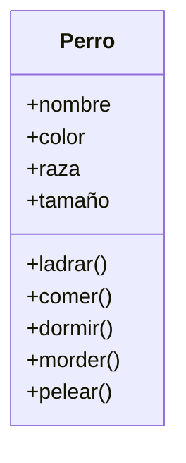

# Curso de Programación Orientada a Objetos

Por [Anahí Salgado Díaz de la Vega](https://platzi.com/profesores/anncode/) | **@anncode**

La misión: lograr que la virtualidad sea idéntica a la realidad. El elegido para esta tarea: tú. Sé parte de la generación que logra cambiar el mundo a través de ideas innovadoras, porque la diferencia entre ser testigo del cambio y ser parte de él comienza con Platzi.

- Conocer los diferentes lenguajes de programación orientados a objetos
- Analizar problemas para el desarrollo de proyectos orientado a objetos
- Entender el funcionamiento de los objetos
- Entender el funcionamiento de las clases

## Bienvenida e introducción

### 1. Por qué aprender POO

- **Programaré más rápido:** Mejoro mi capacidad de análisis, pienso bien lo que voy a hacer antes de entrar al código.
- **Dejo de ser programador Jr:** Dominaré conceptos como Encapsulamiento, abstracción, herencia y polimorfismo. Los cuales son claves para llamar la atención de un reclutadores ya que me hace ver como un programador Sr
- **Dejo de copiar y pegar código:** Ya puedo tomar control sobre mi aplicación, no terminará siendo un Frankenstein, un producto que no sabe donde empieza ni donde termina.

Finalmente tendré la capacidad de:

- **Análizar**: Observar, entender y leer muy bien el problema. Empezaré a pensar de forma distinta.
- **Plasmar:** Diseñaré y crearé los diagramas, después de haber realizado el respectivo análisis.
- **Programar:** Programaré nuestro diagrama con cualquier lenguaje que soporte POO.

 ### 2. Qué resuelve la POO

La programación Orientada a Objetos nace de los problemas creados por la programación estructurada y nos ayuda a resolver cierto problemas como:

- Código muy largo: A medida que un sistema va creciendo y se hace más robusta el código generado se vuelve muy extenso haciéndose difícil de leer, depurar, mantener.
- Si algo falla, todo se rompe: Ya que con la programación estructurada el código se ejecuta secuencialmente al momento de que una de esas líneas fallara todo lo demás deja de funcionar.
- Difícil de mantener.
- Código espagueti, sentencias de control anidadas(if else)

> La POO simplifica la programación.

 ### 3. Paradigma orientado a Objetos

La **Programación Orientada a Objetos** viene de una filosofía o forma de pensar que es la **Orientación a Objetos** y esto surge a partir de los problemas que necesitamos plasmar en código.

Es **analizar un problema en forma de objetos** para después llevarlo a código, eso es la **Orientación a Objetos**.

Un **paradigma** es una teoría que suministra la base y modelo para resolver problemas. La paradigma de Programación Orientada a Objetos se compone de 4 elementos:

- Clases
- Propiedades
- Métodos
- Objetos

Y 4 Pilares:

- Encapsulamiento
- Abstracción
- Herencia
- Polimorfismo

 ### 4. Lenguajes Orientado a Objetos

Algunos de los lenguajes de programación Orientados a Objetos son:

- **Java**:
  - Orientado a Objetos naturalmente
  - Es muy útilizado en Android
  - Y es usado del lado del servidor o Server Side
  - Extensión: `.java`
- **PHP**
  - Lenguaje interpretado
  - Pensado para la Web
  - Extensión: `.php`
- **Python**
  - Diseñado para ser fácil de usar
  - Múltiples usos: Web, Server Side, Análisis de Datos, Machine Learning, etc
  - Extensión: `.py`
- **Javascript**
  - Lenguaje interpretado
  - Orientado a Objetos pero basado en prototipos
  - Pensado para la Web
  - Extensión: `.js`
- C#
- Ruby
- Kotlin

 ### 5. Instalando Visual Studio Code

Pues que comience la aventura y digo aventura porque te darás cuenta de lo emocionante que será poder trabajar 4 lenguajes de programación en un solo entorno de desarrollo y sí, precisamente eso es lo que nos resuelve Visual Studio Code el cual será nuestro campeón en este curso.

Visual Studio Code lo puedes encontrar en las tres versiones básicas de Sistema Operativo (Windows, Mac y Linux) y lo puedes descargar directo en este enlace: https://code.visualstudio.com/download. Es muy ligero y basta con un Siguiente, siguiente, siguiente para instalar.

¡Súper! Todo salió bien. Ahora pasemos a configurarlo para cada lenguaje.

Primero ubica la sección de **Extensiones** o en inglés **Extensions**, además de la barra de Search porque estaremos buscando la extensión para cada lenguaje.

#### Java

- Instala la extensión **Java Extension Pack** de microsoft (son varias extensiones que se instalan)
- Instala la extensión **Debugger for Java**, o verifica si se instaló en el paquete previo.

#### Python

- Instalar python descargando desde python.org
- Instalar la extensión Python en VSC de microsoft.
- Ir a **View > Command Paletter** escribir y seleccionar: *Python: select interpreter*
- Elegir la versión de python instalada en la pc ejm: *python 3.10.2 64-bit*
- Listo eso es todo.

#### PHP

Primero necesitamos instalar el intérprete de PHP, la forma más fácil es descargando XAMPP:

[Descarga XAMPP](https://www.apachefriends.org/es/index.html)

Puedes descargarlo tanto para Linux, Windows o macOS.

Una vez descargado simplemente debes abrirlo e instalarlo dando click al botón de “Next” como cualquier programa normal. Si te sale una ventana de permisos de Firewall simplemente permite ambas opciones:

Con el intérprete instalado, para configurar PHP buscaremos la extensión **PHP Server** y pulsamos “Instalar”

Ahora debemos asegurarnos de que PHP y la extensión estén conectados. Para ello, en Visual Studio Code nos vamos a settings:

Y aquí buscamos “PHP Server”, nos debería aparecer algo como esto:

- En el apartado `Phpserver: PHP Config Path` debe decir: `C:\xampp\php\php.ini`.
- En el apartado `Phpserver: PHP Path` debe decir: `C:\xampp\php\php.exe`.

❗ *Estas rutas pueden variar si durante la instalación de XAMPP cambiaste el directorio de instalación, o si tu Windows está instalado en otro disco que no sea el disco `C:`.*

#### JavaScript

En este caso no necesitamos instalar absolutamente nada, utilizaremos el editor con su configuración por defecto.

---

#### Comencemos nuestro proyecto

Ya está todo listo, ahora dejemos creado el proyecto.

Para esto seleccionaremos la opción **Add workspace folder**

A continuación creamos una carpeta llamada **CursoPOOUber** y damos clic en Add para finalizar. Ahora generemos esta estructura de carpetas para manejar los documentos correspondientes al lenguaje de programación:

- java
- js
- php
- python

¡Ya terminamos, estamos listos!

 ### 6. Diagramas de Modelado

**OMT**: Object Modeling Techniques. Es una metodología para el análisis orientado a objetos. Ya no es usado (1991)

**UML**: *Unified Modeling Language* o *Lenguaje de Modelado Unificado*. Tomó las bases y técnicas de OMT unificándolas. Tenemos más opciones de diagramas como lo son Clases, Casos de Uso, Objetos, Actividades, Iteración, Estados, Implementación. Es el que se está usando (1997).

 ### 7. Qué es UML

Como ya viste UML significa **Unified Modeling Language** el cual es un lenguaje estándar de modelado de sistemas orientados a objetos.

Esto significa que tendremos una manera gráfica de representar una situación, justo como hemos venido viendo. A continuación te voy a presentar los elementos que puedes utilizar para hacer estas representaciones.

#### Las Clases

Las **clases** se representan así:


En la parte superior se colocan los atributos o propiedades, y debajo las operaciones de la clase. Notarás que el primer caracter con el que empiezan es un símbolo. Este denotará la visibilidad del atributo o método, esto es un término que tiene que ver con Encapsulamiento y veremos más adelante a detalle.

Estos son los niveles de **visibilidad** que puedes tener:

**-** private
**+** public
**#** protected
**~** default

Una forma de representar las relaciones que tendrá un elemento con otro es a través de las flechas en UML, y aquí tenemos varios tipos, estos son los más comunes:

##### Asociación


Como su nombre lo dice, notarás que cada vez que esté referenciada este tipo de flecha significará que ese elemento contiene al otro en su definición. La flecha apuntará hacia la dependencia.


Con esto vemos que la ClaseA está asociada y depende de la ClaseB.

##### Herencia


Siempre que veamos este tipo de flecha se estará expresando la herencia.
La dirección de la flecha irá desde el hijo hasta el padre.


Con esto vemos que la ClaseB hereda de la ClaseA

##### Agregación


Este se parece a la asociación en que un elemento dependerá del otro, pero en este caso será: Un elemento dependerá de muchos otros. Aquí tomamos como referencia la multiplicidad del elemento. Lo que comúnmente conocerías en Bases de Datos como *Relaciones uno a muchos*.


Con esto decimos que la ClaseA contiene varios elementos de la ClaseB. Estos últimos son comúnmente representados con listas o colecciones de datos.

##### Composición


Este es similar al anterior solo que su relación es totalmente compenetrada de tal modo que conceptualmente una de estas clases no podría vivir si no existiera la otra.


Con esto terminamos nuestro primer módulo. Vamos al siguiente para entender cómo podemos hacer un análisis y utilizar estos elementos para construir nuestro diagrama de clases de Uber.

## Orientación a Objetos

 ### 8. Objetos

Los Objetos son aquellos que tienen propiedades y comportamientos, también serán sustantivos.

- Pueden ser **Físicos o Conceptuales**

Para identificar objetos debemos tener en cuenta que estos siempre van a tener **propiedades** y **comportamientos**. Además, estos siempre serán sustantivos.

Las **Propiedades** también pueden llamarse atributos y estos también serán sustantivos. Algunos atributos o propiedades son nombre, tamaño, forma, estado, etc. Son todas las características del objeto.

> Es importante tener en cuenta que el atributo no sea el resultado, como Verde. En este caso el atributo es el **Color**.

Los **Comportamientos** serán todas las operaciones que el objeto puede hacer, suelen ser **verbos** o **sustantivos y verbo**. Algunos ejemplos pueden ser que el usuario pueda hacer login, logout o makeReport.

> Es importante tener en cuenta el contexto en que está el objeto



 ### 9. Abstracción y Clases

Una **Clase** es el modelo por el cual nuestros objetos se van a construir y nos van a permitir generar más objetos.

Analizamos Objetos para crear **Clases**. Las **Clases** son los modelos sobres los cuales construiremos nuestros objetos.

**Abstracción** es cuando separamos los datos de un objeto para generar un molde.

 ### 10. Modularidad

La **modularidad** va muy relacionada con las clases y es un principio de la Programación Orientado a Objetos y va de la mano con el *Diseño Modular* que significa dividir un sistema en partes pequeñas y estas serán nuestros módulos pudiendo funcionar de manera independiente.


La **modularidad** de nuestro código nos va a permitir

- Reutilizar: usar un modulo en diferentes partes
- Evitar colapsos
- Hacer nuestro código más mantenible: se puede añadir mas módulos o modificarlos
- Legibilidad: cada módulo es independiente
- Resolución rápida de problemas: el problema se da en solo un módulo

**Clase**

Nos permite:

- Modularidad
- Divide el programa en diferentes partes o módulos/clases
- Separar las clases en archivos diferentes (es una buena práctica)

 ### 11. Analizando Uber en Objetos


**Objetos identificados**

- Usuario
- Ruta
- Conductor
- Autos (uberx, uberpool, etc)
- pago con tarjeta, paypal o cash
- Viaje o trip

 ### 12. Reto 1: identificando Objetos

Sistema de adopciones de perritos, se identifican los siguientes objetos:

- Usuario o adoptante
- Perro o mascota
- Veterinario o director
- Centro de adopción
- catálogo
- reunión (verificación, decisión)
- seguimiento
- adopción (abarca todo)

## Programación Orientada a Objetos: Análisis

 ### 13. Clases en UML y su sintaxis en código


Ejemplo para un objeto persona:


Definición de clases y sus métodos en diferentes lenguajes:

Java

```java
class Person {
    String name = "";
    void walk(){}
}
```

Python

```python
class Person:
    name = ""
    def walk():
```

JavaScript

```js
function Person (){}
Person.prototype.walk = function(){}
```

PHP

```php
class Person {
    $name ="";
    function walk(){}
}
```

 ### 14. Modelando nuestros objetos Uber


 ### 15. Qué es la herencia

**Don’t repeat yourself** es una filosofía que promueve la reducción de duplicación en programación, esto nos va a inculcar que no tengamos líneas de código duplicadas.

Toda pieza de información nunca debería ser duplicada debido a que incrementa la dificultad en los cambios y evolución

La **herencia** nos permite crear nuevas clases a partir de otras, se basa en modelos y conceptos de la vida real. También tenemos una jerarquía de **padre e hijo**.

Puede darse el caso de que la clase padre tenga un hijo o muchos.


A la clase padre también se le conoce como superclase y a las clases hijas como subclases, en algunos lenguajes incluso son palabras reservadas.


 ### 16. Aplicando Herencia a nuestro proyecto Uber


**Modelo UML final:**


 ### 17. Reto 2: analicemos un problema

Imagina que nuestro sistema de adopciones creció y ahora ofrece adoptar pericos, loros, gatos y hamsters.

Genera un nuevo análisis, aplica herencia para abstraer mejor el problema y lograr modularidad en el *software*.

Comparte tus resultados en la sección de discusiones.


## Clases, Objetos y Método constructor

 ### 18. Creando carpetas iniciales para el curso

La estructura de carpetas que estaremos manejando durante el curso será la siguiente:

```tex
CursoPOOUber
├── Java
├── JS
├── PHP
└── Python
```

Básicamente nuestra carpeta raíz será la carpeta `CursoPOOUber` y dentro crearemos las carpetas `Java`, `JS`, `PHP` y `Python` en las cuales iremos guardando nuestros archivos a medida que avanzamos en el curso.

#### Configurando el workspace para Python

En una clase anterior instalamos Python, sin embargo, como estaremos guardando todo el código de este lenguaje dentro de la carpeta `Python` debemos informarle a Visual Studio Code que el código va a estar ahí, de esta forma podemos evitar problemas a futuro cuando usemos módulos.

Para hacer esto es muy sencillo, dentro de nuestra carpeta `CursoPOOUber` vamos a crear una nueva carpeta llamada `.vscode` (ojo, el punto al inicio del nombre es importante). Dentro de esta carpeta vamos a crear un nuevo archivo llamado `settings.json` y dentro de este archivo vamos a poner la siguiente información:

```json
{
    "python.autoComplete.extraPaths": ["./Python"],
}
```

De esta forma le estamos diciendo a nuestro editor de código que todos nuestros archivos de Python van a estar dentro de la carpeta `Python`, por tanto, él sabrá que cualquier módulo deberá leerlo desde esa carpeta, y no desde la carpeta raíz, lo cual evitará que te marque errores en el futuro.

**Es importante** que cuando abras tu proyecto en Visual Studio Code, lo abras desde la carpeta `CursoPOOUber`, de esta forma, el editor de código te mostrará en el árbol de carpetas a tus 5 carpetas que has creado:


¡Estamos listos para empezar a codear! Nos vemos en las siguiente clase donde empezaremos a definir clases con Java y Python.

 ### 19. Definiendo clases en Java y Python

Las clases en Java:

```java
//Main.java
class Main {
    public static void main(String[] args) {
        System.out.println("Hello World");
    }
}
//Account.java
class Account {
    Integer id;
    String name;
    String document;
    String email;
    String password;
}
//Car.java
class Car {
    Integer id;
    String license;
    String driver;
    Integer passenger;
}
//Payment.java
class Payment {
    Integer id;
}
//Route.java
import java.util.ArrayList;

public class Route {
    Integer id;
    ArrayList<Double> start;
    ArrayList<Double> end;
}
```

Las clases en Python:

```python
#main.py
if __name__ == "__main__":
    print("Hello World!")
#account.py
class Account:
    id          = int
    name        = str
    document    = str
    email       = str
    password    = str
#car.py
class Car:
    id          = int
    license     = str
    driver      = str
    passenger   = int
#payment.py
class Payment:
    id  = int
#route.py
class Route:
    id      = int
    start   = []
    end     = []
```

 ### 20. Definiendo Clases en JavaScript

JavaScript

```js
//Account.js
function Account(){
    this.id;
    this.name;
    this.document;
    this.email;
    this.password;
}
//Car.js
function Car(){
    this.id;
    this.license;
    this.driver;
    this.passenger;
}
//Payment.js
function Payment(){
    this.id;
}
//Route.js
function Route(){
    this.id;
    this.init;
    this.end;
}
```

PHP

```php
//Account.php
<?php
class Account {
    public $id;
    public $document;
    public $email;
    public $password;
}
//Car.php
<?php
class Car {
    public $id;
    public $driver;
    public $passengers;
}
//Payment.php
<?php
class Payment {
    public $id;
}
//Route.php
<?php
class Route{
    public $id;
    public $start = array();
    public $end = array();
}
```

 ### 21. Objetos, método constructor y su sintaxis en código

Los **objetos** nos ayudan a crear instancia de una clase, el objeto es el resultado de lo que modelamos, de los parámetros declarados y usaremos los objetos para que nuestras clases cobren vida.

Maneras de declarar objetos:

```java
//java
Person person = new Person();
```

```javascript
//JavaScript
var person = new Person();
```

```php
//php
$person = new Person();
```

```python
#Python
person = Person();
```

Los **métodos constructores** dan un estado inicial al objeto y podemos añadirle algunos datos al objeto mediante estos métodos. Los atributos o elementos que pasemos a través del constructor serán los datos mínimos que necesita el objeto para que pueda vivir.

```java
//Java
public Person (String name){
    this.name = name;
}
Person person = new Person ("Ann");
```

```js
//JavaScript
function Person (name){
    this.name = name;
}
var person = new Person("Ann");
```

```php
//php
public function_constructor ($name){
    $this->name = name;
}
$person = new Person ("Ann");
```

```python
#Python
def__init__(self, name):
    self.name = name;
person = Person ("Ann")
```

 ### 22. Objetos. Dando vida a nuestras clases en Java y Python

Java:
```java
//main.java
class Main {
    public static void main(String[] args) {
        System.out.println("Hello World");
        Car car = new Car();
        car.license = "AMG232";
        car.driver = "Andres Herrera";
        car.passenger = 4;
        car.printDataCar();

        Car car1 = new Car();
        car1.license = "AFD45";
        car1.driver = "Juan Martinez";
        car1.passenger = 2;
        car1.printDataCar();
    }
}
```
Python:
```python
#main.py
from hashlib import new
from car import Car

if __name__ == "__main__":
    print("Hello World!")
    car = Car()
    car.license = "ASD234"
    car.driver = "Andres Herrera"
    print(vars(car))

    car2 = Car()
    car2.license = "AKD234"
    car2.driver = "Juan Martinez"
    print(vars(car2))
```

 ### 23. Declarando un Método Constructor en Java y JavaScript


 ### 24. JavaScript orientado a objetos, lo más nuevo
 ### 25. Declarando un método constructor en Python

## Herencia

 ### 26. Aplicando herencia en lenguaje Java y PHP
 ### 27. Solución del reto de herencia en PHP
 ### 28. Aplicando herencia en lenguaje Python y JavaScript
 ### 29. Otros tipos de Herencia
 ### 30. Reto 4

## Encapsulamiento

 ### 31. Encapsulamiento
 ### 32. Encapsulando atributos en Java

## Polimorfismo

 ### 33. Generando polimorfismo en Java
 ### 34. Generando polimorfismo en PHP

## Cierre del curso

 ### 35. El diagrama UML de Uber
 ### 36. Conclusiones
 ### 37. Bonus: Qué es la programación Orientada a Objetos

